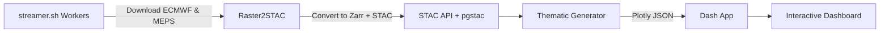

# StreamViz 🌍📡


**StreamViz** is a prototype **weather data streaming and visualization platform** that automates the full pipeline from **operational NWP forecast ingestion** to **interactive, sector-specific dashboards**.  
It demonstrates how raw model data (ECMWF IFS, MET Norway MEPS, etc.) can be streamed, transformed into STAC/Zarr assets, and visualized as actionable weather intelligence for decision-makers.

---

## 🚀 Features

- **Automated Forecast Streaming**
  - `streamer.sh` schedules 24/7 downloads via screen sessions.
  - Python workers in `streamer/` fetch ECMWF IFS & MEPS forecasts (surface & pressure level fields).
  - Pre-processing: cleaning, cropping, temporal & spatial regridding to EPSG:4326.

- **STAC + Zarr Data Management**
  - [`raster2stac`](https://github.com/suriyahgit/raster2stac) converts Xarray datasets to Zarr.
  - STAC `collections` and `items` registered to a local **STAC API** (`stac-fastapi` + `pgstac`).
  - End-to-end reproducibility with `docker-compose.yml` + `start-stac.sh`.

- **Professional Weather Intelligence Dashboard**
  - `thematic_generator_dashboard.py` generates **Plotly JSON** visualizations into `plot_dump/`.
  - Organized into thematic tabs:
    - Wind Energy
    - Solar Energy
    - Insurance Risk
    - District Heating
    - Aviation & Logistics
  - Scalars (precipitation, cloud cover, radiation, etc.) → pre-colorized PNGs  
  - Vectors (winds at 10m/100m, gusts) → SVG arrows  
  - Overlays → **Natural Earth (10m)** coastlines & borders  
  - 24 forecast steps with slider + play/pause controls.

- **Interactive Dash App**
  - `dash_app.py` serves a web dashboard powered by Plotly/Dash.
  - Auto-loads JSON figures from `plot_dump/`.
  - Clean tab layout by themes (`t1_*, t2_* … compare_*` naming convention).
  - Pan/zoom with fixed bounding box (Central Europe → Scandinavia).

---

## Quick Start (minimal)

> **Note:** After cloning, installing the **StreamViz package** is **mandatory**.

### 1) Create and activate the environment
```bash
# From repo root
micromamba create -f environment.yml -n streamviz
micromamba activate streamviz
# or: conda env create -f environment.yml && conda activate streamviz
````

### Install extra system/python deps

```bash
chmod +x installs_needed.sh
./installs_needed.sh
```

> You may see a few **warnings / errors** about package incompatibilities — **ignore them**.
> They do **not** affect the functionality of this project.


## .env (minimal template)

Create a `.env` in the repo root:

```bash
cat > .env << 'EOF'
# Ports
STAC_API_PORT=8081
DASH_PORT=8050
BROWSER_PORT=9090

# Postgres / pgSTAC
POSTGRES_USER=stac
POSTGRES_PASSWORD=stac
POSTGRES_DB=stac
POSTGRES_PORT=5432

# Local data dirs
PG_DATA=./.pgdata
PLOT_DUMP_DIR=./plot_dump
EOF
```

---

## Docker (build & run only)

```bash
make build
make up-detached
```

That’s it.

---

## Running the streamer & generator

```bash
# Streamer (orchestrates forecast downloads & STAC posting) - Run it on a screen session
./streamer.sh

# Thematic generator (writes Plotly JSON into ./plot_dump) - trigger this operation manually after STAC entries are visible

python thematic_generator_dashboard.py
```

> **Status:** `streamer.sh` and `thematic_generator_dashboard.py` are **temporarily unplugged** for ongoing dev work and will be re-enabled soon.


## Dashboard

Once the stack is running and you have figures in `./plot_dump`, open:
- **Dash UI:** http://localhost:${DASH_PORT:-8050}

If `plot_dump/` is empty, the UI will load but no maps will appear. When the generator is re-plugged, it will produce the JSON frames here automatically.

---

## Testing without the generator

A small set of JSON figures can be placed in `plot_dump/` to validate the UI wiring (tabs, time slider, overlays). If you already have sample JSON, just drop them into `./plot_dump` and refresh the browser.

---

## Make targets (cheatsheet)

```text
make build           # build all images
make up-detached     # start entire stack in background
make down            # stop & remove containers
make status          # show running services
make logs            # tail all logs
````

> For advanced targets (db migrations, browser helpers, etc.), see the Makefile. The minimal flow above is enough to run the stack.

---

## Development notes

* Python package install is **required** (`pip install -e .`) after creating the `environment.yml` env and running `installs_needed.sh`.
* You might see **dependency warnings / minor resolver errors** during setup — **safe to ignore** for this project.
* Overlays use **Natural Earth 10m** GeoJSON in `./ne/`.
* The Dash app reads figures from `PLOT_DUMP_DIR` (defaults to `./plot_dump` or value from `.env`).

---

## Known limitations (current)

* `streamer.sh` and `thematic_generator_dashboard.py` are **temporarily unplugged** due to development work and will be re-enabled soon.
* The UI is stable; missing figures only affect the visible layers, not the app itself.

---

## Contributing

1. Create a new branch: `git checkout -b feature/my-change`
2. Commit changes: `git commit -m "feat: add X"`
3. Push and open a PR.

Please keep PRs focused and include a brief description of the change and any migration notes.

---

## 🧩 Pipeline Overview



---

## 🧰 Development

* Python 3.11+
* Core libraries: `xarray`, `dask`, `pystac-client`, `plotly`, `dash`, `raster2stac`
* Services: `stac-fastapi`, `pgstac`, `docker-compose`

---

## 📎 References

* [ECMWF Open Data](https://www.ecmwf.int/en/forecasts/datasets/open-data)
* [MET Norway MEPS](https://thredds.met.no/thredds/catalog/mepslatest/catalog.html)
* [STAC Spec](https://stacspec.org)
* [Raster2STAC](https://github.com/suriyahgit/raster2stac) ← authored by this repo owner

---

## 🔗 Related Projects

* 🌐 [StreamViz GitHub](https://github.com/suriyahgit/StreamViz)
* 📦 [Raster2STAC](https://github.com/suriyahgit/raster2stac)

---

## 📜 License

MIT License © 2025 [Suriyah Dhinakaran](https://github.com/suriyahgit)

